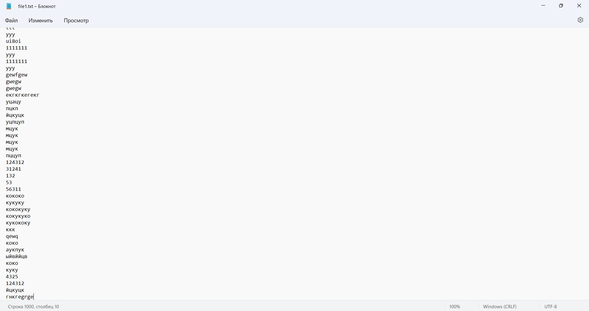
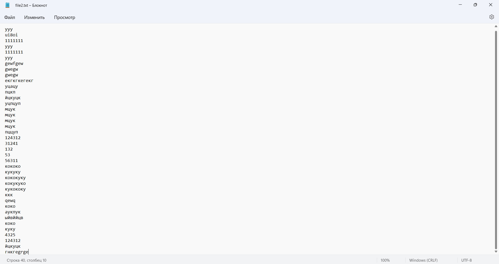
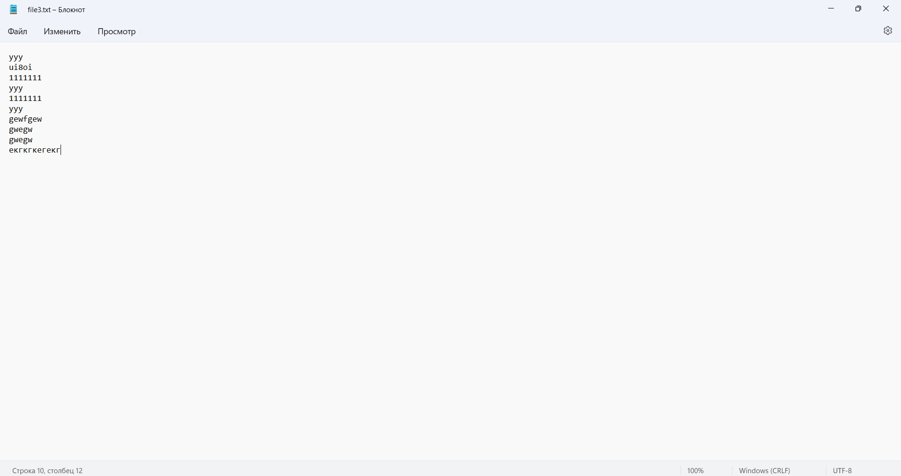
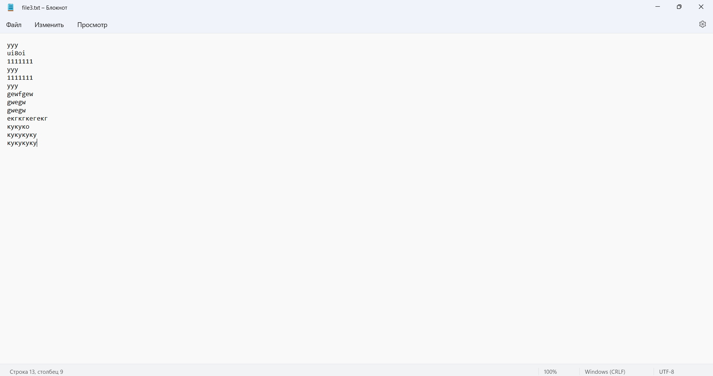
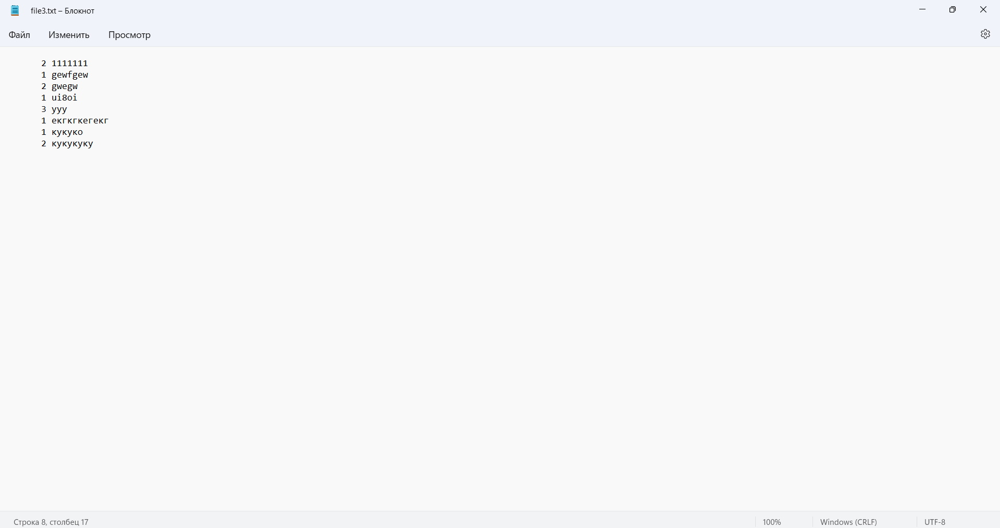
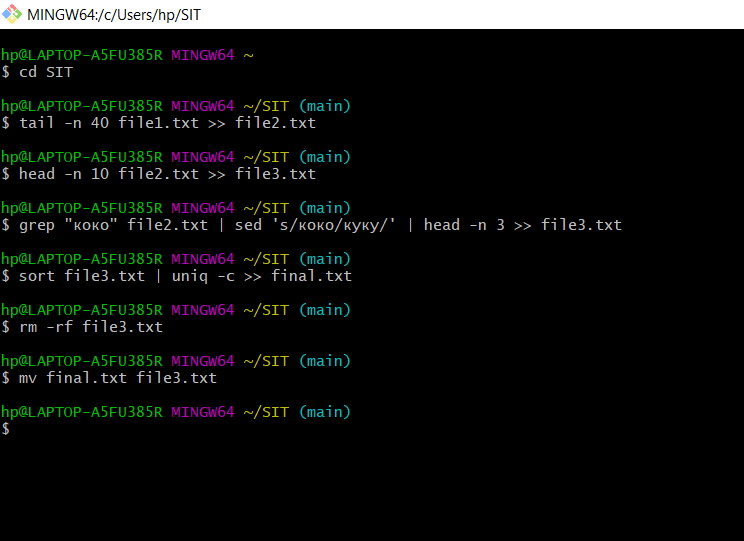

# TextProcessors
Сначала с помощью волшебной комбинации “Ctrl+C Ctrl+V” создаём и наполняем file1.txt тысячей строчек. Затем переходим к выполнению лабы.
          
          
  1)	Выберем последние 40 строк из file1.txt и записываем в file2.txt. Сделать это несложно с помощью tail, который мы рассмотрели ещё на первой паре:
          
          tail -n 40 file1.txt >> file2.txt
          
          
          
  2)	Запишем первые 10 строк из file2.txt в file3.txt. Полностью аналогично, только с head:
         
         head -n 10 file2.txt >> file3.txt
          
          
          
  3)	Выберем строки из file2.txt, содержащие “коко”, заменим в них “коко” на “куку” и запишем в file3.txt первые три вхождения. Тут уже чуть посложнее: сначала мы найдём нужные строчки с помощью утилиты grep, затем (тут же, в этой же команде) произведём замену, воспользовавшись sed, а затем выберем первые 3 строчки из полученных с помощью старого доброго head:
          
          grep "коко" file2.txt | sed 's/коко/куку/' | head -n 3 >> file3.txt
          
          
          

Затем надо оставить только уникальные строки и вывести количество каждой строки. Это выполним в несколько приёмов:

  4)	Сначала отсортируем строчки с помощью sort, чтобы позже uniq сработал как надо, после чего воспользуемся самим uniq (флаг -c позволит нам сразу вывести число строк, не занимаясь извращениями), и запишем результат в отдельный файл final.txt:
          
          sort file3.txt | uniq -c >> final.txt
          
          
          
  5)	Далее удалим старый файл file3.txt – он нам теперь ни к чему, ибо старые строки нам в нём не нужны:
          
          rm -rf file3.txt
  6)	А теперь переименуем final.txt в file3.txt:
          
          mv final.txt file3.txt

          
          
          
В результате в file3.txt у нас есть только уникальные строчки, и для каждой указано, сколько раз она встречается. Что и требовалось получить.

Входной файл file1.txt и все файлы, полученные в ходе работы программы (file2.txt и финальная версия file3.txt) приложены, см. в папке.
Вид окна Баша после всего примерно такой:
          
          
______________________________________________________________

# Все использованные команды:

  tail -n 40 file1.txt >> file2.txt
  
  head -n 10 file2.txt >> file3.txt
  
  grep "коко" file2.txt | sed 's/коко/куку/' | head -n 3 >> file3.txt
  
  sort file3.txt | uniq -c >> final.txt
  
  rm -rf file3.txt
  
  mv final.txt file3.txt
  
